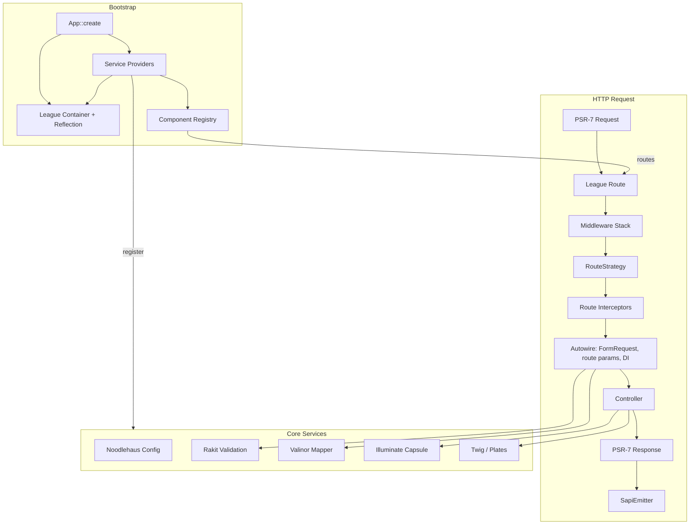

# Concept Core

## Concept Core is an aesthetic, strict-typed PHP engine built on PSR standards.
**A strict-typed PHP application engine for builders who want ergonomics without the monolith.**

Concept Core is the foundation of the Concept stack: a lean, PSR-native runtime that wires routing, DI, validation, database access, views, and CLI into a coherent whole — then gets out of your way. Applications are assembled from **components**: self-contained modules that ship their own routes, migrations, seeders, views, assets, and service providers.

Built for **PHP 8.4+**, every public API uses `declare(strict_types=1)` and is designed to be extended, not overridden.

No magic — no hidden conventions you cannot grep for.

---

## Why Concept Core?

| You get | Without                                          |
|--------|--------------------------------------------------|
| Named routes, middleware, FormRequests, DTO casting | Re-implementing half of a framework on every project |
| Illuminate Database (Eloquent, migrations, pagination) | Dragging in all of Laravel                       |
| Twig or Plates, your choice | Lock-in to one templating story                  |
| Component registry — drop in Auth, ACL, CMS as packages | Copy-pasting modules between repos               |
| PSR-7 HTTP, PSR-11 container, PSR-15 middleware | Fighting legacy globals                          |
| Whoops in dev, safe fallbacks in prod | White screens and silent failures                |
| Built-in telemetry hooks | Guessing what booted and when                    |

Concept Core is **not** a CMS and **not** a full-stack framework. It is an **engine**: opinionated where it matters (request lifecycle, validation, errors), flexible everywhere else (authorization, business logic, UI).

---

## Architecture at a glance



**Request flow**

1. `App` boots service providers; `ComponentsServiceProvider` registers component routes, migrations, seeders, views, and commands.
2. `Router` matches a route; middleware runs (CSRF, validation handler, view data, …).
3. `RouteStrategy` invokes the handler: **route interceptors** first, then autowiring (FormRequest validation, route-param casting, `ServerRequestInterface`).
4. Controller returns a PSR-7 response; `SapiEmitter` sends it.

---

## Tech stack

| Layer | Library |
|-------|---------|
| HTTP messages | [laminas/laminas-diactoros](https://github.com/laminas/laminas-diactoros) |
| HTTP runner | [laminas/laminas-httphandlerrunner](https://github.com/laminas/laminas-httphandlerrunner) |
| Routing | [league/route](https://github.com/thephpleague/route) |
| DI | [league/container](https://github.com/thephpleague/container) |
| Database | [illuminate/database](https://github.com/illuminate/database) |
| Validation | [rakit/validation](https://github.com/rakit/validation) (via [magewirephp/validation](https://github.com/magewirephp/validation)) |
| DTO mapping | [cuyz/valinor](https://github.com/CuyZ/Valinor) |
| Views | [twig/twig](https://github.com/twigphp/Twig) or [league/plates](https://github.com/thephpleague/plates) |
| Console | [symfony/console](https://github.com/symfony/console) |
| Sessions & flash | [symfony/http-foundation](https://github.com/symfony/http-foundation) |
| Config | [hassankhan/config](https://github.com/hassankhan/config) |
| Logging | [monolog/monolog](https://github.com/monolog/monolog) |
| Errors (dev) | [filp/whoops](https://github.com/filp/whoops) |
| Env | [vlucas/phpdotenv](https://github.com/vlucas/phpdotenv) |

---

## Quick start

### Install

```bash
composer require php-concept/core
```

Requires **PHP 8.4+** and extensions: `pdo`, `json`, `mbstring`, `dom`, `xml`.

### Minimal bootstrap

```php
<?php declare(strict_types=1);

use Concept\Core\App;

$rootPath = dirname(__DIR__);
$paths = include $rootPath . '/bootstrap/paths.php';

$app = App::create($rootPath, $paths);
$app->registerServiceProviders([
    $rootPath . '/bootstrap/providers/app.php',
]);

return $app;
```

### Front controller (`public/index.php`)

```php
<?php declare(strict_types=1);

$app = require dirname(__DIR__) . '/bootstrap/app.php';
$app->run();
```

### Console entry (`bin/console.php`)

```php
<?php declare(strict_types=1);

use Symfony\Component\Console\Application as ConsoleApplication;

$app = require dirname(__DIR__) . '/bootstrap/app.php';
$app->registerServiceProviders([dirname(__DIR__) . '/bootstrap/providers/console.php']);

/** @var ConsoleApplication $console */
$console = $app->getContainer()->get(ConsoleApplication::class);
exit($console->run());
```

---

## Components — the killer feature

A **component** is a vertical slice of your application: routes, providers, migrations, seeders, views, console commands, and publishable assets — bundled behind one class.

```php
<?php declare(strict_types=1);

namespace Concept\Components\AuthAdmin;

use Concept\Core\Components\Component\Contracts\ComponentInterface;
use Concept\Core\Components\Database\Contracts\SeederInterface;
use League\Container\ServiceProvider\ServiceProviderInterface;
use Symfony\Component\Console\Command\Command;

class AuthAdminComponent implements ComponentInterface
{
    public function name(): string
    {
        return 'auth-admin';
    }

    public function version(): string
    {
        return '1.0.0';
    }

    public function description(): string
    {
        return 'Admin authentication module';
    }

    public function routes(): ?string
    {
        return __DIR__ . '/routes.php';
    }

    /** @return class-string<ServiceProviderInterface>[] */
    public function providers(): array
    {
        return [];
    }

    /** @return class-string[] */
    public function viewExtensions(): array
    {
        return [];
    }

    /** @return array<string, string> */
    public function viewPaths(): array
    {
        return ['auth-admin' => 'src/Components/AuthAdmin/Views'];
    }

    /** @return array<string, string> */
    public function viewContexts(): array
    {
        return ['/admin' => 'dashboard'];
    }

    /** @return class-string<Command>[] */
    public function commands(): array
    {
        return [];
    }

    /** @return class-string<SeederInterface>[] */
    public function seeders(): array
    {
        return [];
    }

    /** @return list<string> migration directory paths */
    public function migrations(): array
    {
        return [__DIR__ . '/Database/Migrations'];
    }

    /** @return array<string, string> */
    public function assets(): array
    {
        return [];
    }
}
```

Register the component class in config (resolved from the container via `ReflectionContainer`):

```php
// config/components.php
return [
    'components' => [
        AuthAdminComponent::class,
    ],
];
```

`ComponentsServiceProvider` automatically:

- loads each component's `routes()` file into the router;
- registers component service providers;
- merges migration paths and seeder classes into registries;
- attaches Twig extensions and view namespaces;
- registers console commands;
- maps URL prefixes to view contexts (e.g. `/admin` → `dashboard` layout).

**`ComponentInterface` methods:**

| Method | Returns |
|--------|---------|
| `providers()` | Extra DI service provider classes |
| `migrations()` | Migration directory paths |
| `seeders()` | Seeder class names |
| `commands()` | Symfony console command classes |
| `viewPaths()` | Twig/Plates namespaces (`@auth-admin/...`) |
| `viewContexts()` | URI prefix → layout namespace |
| `viewExtensions()` | Twig extension classes |
| `assets()` | Source → public publish map |

Ship a feature once. Reuse it in every project.

---

## HTTP layer

### Routing

Routes live in plain PHP files. League Route gives you groups, middleware, and named routes:

```php
$router->group('/admin/users', function (RouteGroup $route) {
    $route->get('/', [UserController::class, 'index'])->setName('admin.users');
    $route->post('/store', [UserController::class, 'store'])->setName('admin.user.store');
})->lazyMiddleware(AuthMiddleware::class);
```

Generate URLs anywhere:

```php
$url = $urlGenerator->uri('admin.user.edit', ['id' => 5]);
```

List routes from CLI:

```bash
php bin/console.php route:list
php bin/console.php route:list --full-middleware
```

### RouteStrategy — autowiring that actually helps

The controller instance is resolved from the container (constructor injection via `ReflectionContainer`). Action method parameters are filled by `RouteStrategy`:

| Parameter type | Resolved from |
|----------------|---------------|
| `FormRequest` subclass | Container instance, **validated**, injected (throws `ValidationException` on failure) |
| `ServerRequestInterface` | Current PSR-7 request (route vars already attached) |
| Route vars (`int $id`) | URL segment, cast via Valinor (`CasterInterface`) |
| Parameters with defaults | Default value |
| Anything else | `null` |

No manual `$request->getAttribute('id')` boilerplate for route parameters.

### Route interceptors

Pre-controller hooks configured in `config/routes.php`:

```php
return [
    'routes' => [
        'interceptors' => [
            AclRouteAuthorization::class, // implement RouteInterceptorInterface
        ],
        'list' => [__DIR__ . '/../routes/web.php'],
    ],
];
```

Throw your own exceptions; core stays agnostic. Pair with middleware like `HandleValidationExceptionMiddleware` for redirects and JSON errors.

### Built-in middleware

| Middleware | Role |
|------------|------|
| `VerifyCsrfTokenMiddleware` | CSRF verification on mutating requests |
| `HandleValidationExceptionMiddleware` | Redirect back with errors / JSON 422 |
| `ShareViewDataMiddleware` | Flash, old input, CSRF token → view context |
| `StorePreviousUrlMiddleware` | Tracks previous/current URL in session; sets `safe_back_url` for `ResponseFactory::back()` |
| `ParseJsonBodyMiddleware` | JSON request bodies |
| `ForceJsonResponseMiddleware` | API-style error responses |

### Response factory

```php
return $this->response->json(['users' => $users]);
return $this->response->jsonSuccess($data);
return $this->response->jsonError('Not found', 404);
return $this->response->redirectByName('admin.users');
return $this->viewResponse->create('@dashboard/index', ['title' => 'Home']);
```

---

## Validation & DTOs

### FormRequest

```php
/** @extends FormRequest<StoreUserDto> */
class StoreUserRequest extends FormRequest
{
    protected ?string $dtoClass = StoreUserDto::class;

    protected array $except = ['password_confirmation'];

    public function rules(): array
    {
        return [
            'name' => ['required', 'min:3'],
            'email' => ['required', 'email', 'unique:users,email'],
            'password' => ['required', 'min:8'],
        ];
    }
}
```

In the controller:

```php
public function store(StoreUserRequest $request): ResponseInterface
{
    $dto = $request->toDto();           // Valinor-mapped immutable DTO
    $data = $request->validated();      // plain array
    // ...
}
```

Features:

- Rakit rules with custom rule registration via config;
- localized messages from `{validator_translations}/{locale}.php` (path mapped in `bootstrap/paths.php`, typically `resources/lang/validator`);
- field aliases and per-request message overrides;
- automatic CSRF field exclusion;
- optional validation payload logging (masked).

### Valinor casting

Route parameters and DTOs are mapped with [Valinor](https://github.com/CuyZ/Valinor) — cached mappers, scalar coercion, superfluous key tolerance. Route-param cast failures throw `CastingException`; DTO mapping via `FormRequest::toDto()` wraps failures as `ValidationCastException`.

---

## Database

Illuminate **Capsule** + **Eloquent** without the Laravel kernel:

- fluent query builder and Eloquent models;
- migrations via `Illuminate\Database\Migrations\Migrator`;
- seeders aggregated from app + components;
- pagination wired to the current request URI;
- optional SQL query logging to Monolog.

### CLI

```bash
php bin/console.php db:migrate
php bin/console.php db:rollback
php bin/console.php migration:list
php bin/console.php db:seed
php bin/console.php db:seed -c "Concept\Components\AuthAdmin\Database\Seeders\UserSeeder"
php bin/console.php seeders:list
```

Migrations and seeders from all registered components are merged automatically.

---

## Views

Switch engines via service provider — register **one** of:

- `TwigServiceProvider` (`.twig`, compiled cache in production)
- `PlatesServiceProvider` (`.php` templates)

### Namespaces & contexts

App-level config (`config/view.php`) or component `viewPaths()` / `viewContexts()` / `viewExtensions()`:

```php
// config/view.php (app-level)
return [
    'view' => [
        'paths' => [
            'dashboard' => 'resources/views/dashboard',
        ],
        'contexts' => [
            '/admin' => 'dashboard',  // auto-select layout namespace by URL prefix
        ],
        'extensions' => [
            UrlGeneratorTwigExtension::class,  // your Twig extension
        ],
    ],
];
```

Render:

```twig

{# URL helpers require a Twig extension you register in view.extensions #}
<a href="{{ uri('admin.users') }}">Users</a>
```

`ShareViewDataMiddleware` injects `errors`, `old`, `flashes`, and `csrf_token` into every view.

```bash
php bin/console.php view:clear
```

---

## Configuration

PHP config files merged via Noodlehaus Config. Canonical keys live in `Concept\Core\Foundation\ConfigKey`:

- `app.name`, `app.debug`, `app.version`, `app.locale`, `app.fallback_locale`, `app.timezone`
- `db.*`, `session.*`, `log.*` (`log.query`, `log.validation_data`)
- `routes.list`, `routes.interceptors`
- `components`, `commands`, `migrations.paths`, `migrations.table`, `seeders.list`
- `view.paths`, `view.contexts`, `view.extensions`, `view.cache_dir`, `view.default_extension`
- `validator.rules`, `masking.*`, `telemetry.enabled`

`.env` support through `vlucas/phpdotenv` in the application skeleton.

---

## Security

- **CSRF** — token generation, session storage, middleware verification, shared as `csrf_token` view global.
- **Session** — secure cookie options (lifetime, `SameSite`, `HttpOnly`, strict mode).
- **Data masker** — redact passwords, tokens, and custom patterns before they hit logs.
- **Validation whitelist** — `validated()` returns only keys defined in `rules()`.

Authorization (ACL, policies, gates) is intentionally **application-level** via route interceptors and middleware — core provides the hook, you bring the rules.

---

## Error handling

Errors are handled from the first line of bootstrap:

| Environment | Behaviour |
|-------------|-----------|
| `APP_DEBUG=true` | Whoops Pretty Page (web) |
| CLI | Plain text stack traces |
| Production web | Branded fallback from `errors_fallback_views` path (`bootstrap/paths.php`; typically `resources/views/errors/fallback`) |
| JSON requests | Whoops `JsonResponseHandler` when `RequestFormat::expectsJson()` |

All paths log through `PhpErrorLogHandler` → Monolog. Before providers boot, early failures use `resources/views/errors/fallback/500.php`. Production handler never leaks stack traces to users.

---

## Telemetry

When `telemetry.enabled` is true, the framework records bootstrap milestones:

- service provider awakening;
- component registration;
- per-route controller invocation timing.

Useful for debug bars and performance profiling. Access via `TelemetryCollector` in the container.

---

## Logging

Monolog with rotating file handler (`storage/logs`). Configurable level, retention, and channel name. Database queries and validation payloads can be logged with automatic masking.

---

## Locale

`LocaleServiceProvider` resolves the active locale from config or a custom `LocaleResolverInterface` (`app.locale_resolver`). Validation messages load from `{validator_translations}/{locale}.php` with `app.fallback_locale` fallback.

---

## Service providers (built-in)

| Provider | Registers |
|----------|-----------|
| `ConfigServiceProvider` | Config, PathManager, `.env` |
| `HttpServiceProvider` | Router, PSR-7 request, URL generator, responses |
| `SessionServiceProvider` | Symfony session & flash bag |
| `ValidationServiceProvider` | Rakit validator, translations |
| `CastingServiceProvider` | Valinor `CasterInterface` |
| `DatabaseServiceProvider` | Capsule, migrator, seeder manager |
| `TwigServiceProvider` / `PlatesServiceProvider` | View engine |
| `ViewRegistryServiceProvider` | Paths, extensions, contexts |
| `ComponentsServiceProvider` | Component boot (routes, migrations, …) |
| `ConsoleServiceProvider` | Symfony Console application |
| `LogServiceProvider` | Monolog |
| `ErrorHandlerServiceProvider` | Whoops handlers per environment |
| `TelemetryServiceProvider` | Telemetry collector |
| `DataMaskerServiceProvider` | Log redaction rules |
| `LocaleServiceProvider` | Locale resolution |
| `DebugLoggerServiceProvider` | In-memory debug log (dev tools) |

Register only what you need in `bootstrap/providers/app.php`.

---

## Console commands (core)

| Command | Description |
|---------|-------------|
| `route:list` | All registered routes, middleware, handlers |
| `db:migrate` | Run pending migrations |
| `db:rollback` | Roll back last batch |
| `migration:list` | Recent migrations from the database table |
| `db:seed` | Run seeders (all or `-c ClassName`) |
| `seeders:list` | Registered seeder classes |
| `component:list` | Installed components |
| `component:publish-assets` | Copy component assets to `public/` |
| `view:clear` | Clear compiled Twig cache |

Components can register their own commands the same way.

---

## Development

```bash
composer test              # PHPUnit
composer phpstan           # Static analysis
composer test:coverage     # PCOV coverage report
```

The core ships with **70+ test classes** covering routing, validation, providers, middleware, Whoops integration, and component boot sequences.

---

## Design principles

1. **Strict types everywhere** — fewer surprises at runtime.
2. **PSR first** — interoperable HTTP, container, middleware.
3. **Composition over inheritance** — components and providers, not base controller magic.
4. **Explicit configuration** — no hidden conventions you cannot grep for.
5. **Fail loud in dev, safe in prod** — Whoops vs fallback views.
6. **Batteries included, swappable** — Twig or Plates.

---

## Project layout (application skeleton)

```
├── bin/console.php          # CLI entry
├── bootstrap/
│   ├── app.php              # App::create + providers
│   ├── paths.php            # PathName → relative dirs
│   └── providers/
│       ├── app.php          # Web service providers
│       └── console.php      # + ConsoleServiceProvider
├── config/                  # PHP config files
├── routes/web.php           # Application routes
├── src/
│   ├── App/                 # App-specific code
│   └── Components/          # Feature modules
├── resources/views/         # Global templates
├── database/migrations/     # App-level migrations
└── public/index.php         # Front controller
```

---

Read the [Documenation](https://php-concept.github.io/concept-docs/en/index.html)

---

## License

MIT © Concept Framework contributors.

---

<p align="center">
  <strong>Concept Core</strong> — small kernel, sharp edges, infinite composition.<br>
  Build the app. Ship the component. Repeat.
</p>
